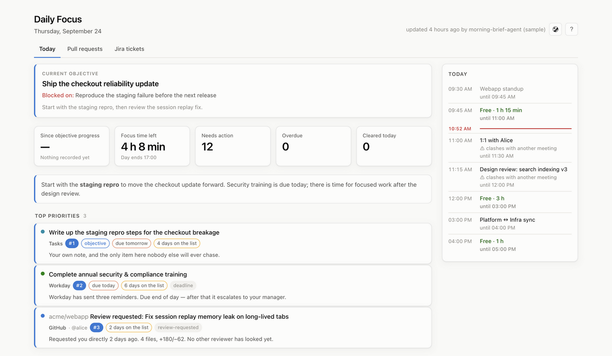

# Daily Focus

A personal dashboard for deciding what to work on today. Keep it in a pinned tab
for your priorities, meetings, open pull requests, and Jira tickets.



*The Today tab with fictional sample data.*

A morning agent gathers updates from your connected tools and writes a short brief.
You set the objective; the agent helps you choose work that moves it forward.
Mark an item done, snooze it, or leave a note, and the next brief takes that into
account. GitHub and Jira boards refresh throughout the day.

## Try it

You'll need Node.js 22.18 or newer. Node 24 is recommended.

From a checkout of this repo, run these commands in the same terminal:

```sh
npm install
export DAILY_FOCUS_DATA=$(mktemp -d)
export DAILY_FOCUS_GITHUB=off DAILY_FOCUS_JIRA=off DAILY_FOCUS_CALENDAR=off
npm run seed
npm start
```

Open [localhost:4321](http://127.0.0.1:4321). This demo uses a temporary store and
sample data, so you can explore without connecting accounts or replacing a real brief.
Stop it with Ctrl+C. Close the terminal when you're done to clear the demo settings.

To use your own data, follow [SETUP.md](SETUP.md). It covers your objective,
the morning agent, optional integrations, and every setting. The dashboard runs
locally; you bring the agent and scheduler that produce the brief.

## Your day at a glance

The **Today** tab puts your objective and top priorities beside your agenda.
It shows meeting conflicts, free time for focused work, and how long it has been
since you completed something that advanced your objective.

- Mark tasks **Done** when you've handled them.
- **Snooze** an item until a date, or **Dismiss** it if it doesn't need attention.
- Leave a **Note** for the next brief, such as "already replied on Slack".
- Press **f** for focus mode, which shows your top item and agenda.
- Press **p** on an item to start a focus timer. Its countdown appears in the tab
  title, and the session becomes part of the next brief's context.

The timer keeps counting after its target time. On macOS, it ends a session when
you've been away from the machine, excluding the time you were away. On systems
without idle detection, a two-hour limit caps the recorded session.

You can undo item actions except notes. The page updates as new data arrives, and
the theme button switches between system, light, and dark mode.

## The pull request board

The second tab shows your open pull requests in seven buckets:

| Bucket | What it means |
|---|---|
| Waiting on you | A failure, conflict, requested change, outdated branch, or new activity needs your attention. |
| Ready to merge | Required reviews and checks are satisfied, and GitHub allows the merge. |
| Waiting on reviewers | A review is still needed. The board flags when it may be time to ask. |
| Waiting on merge gate | A check you've configured as a merge gate is pending. |
| Merge blocked by GitHub | GitHub reports a policy block without an unfinished check to explain it. |
| Waiting on checks | Checks are running, or GitHub reports an unstable merge. |
| Drafts | Pull requests you haven't marked ready for review. |

Park a pull request until a date, leave a note, or click **Nudged** after asking
for a review. Nudged records a note; it doesn't send a message. Completing a task
about a pull request in the brief doesn't remove that pull request from the board.

Cancelled checks appear as "cancelled, no verdict" rather than failures.
When a check is rerun, the board uses its newest workflow run or attempt.

## The Jira ticket board

The third tab helps you spot statuses that may need updating. Its **Out of sync**
view has three buckets:

| Bucket | What it means |
|---|---|
| No open pull requests left | Linked pull requests are closed, but the ticket isn't done. Check whether any work remains. |
| Work has started, the ticket has not | A pull request is open while the ticket still has a not-started status. |
| In flight with nothing linked | The ticket is in progress with no linked pull request. This can be fine for work that isn't code. |

Draft pull requests count as open. Closed pull requests don't prove that a ticket
is finished, so the board leaves that decision to you. Park a reminder or leave a
note when there's more work planned.

Switch to **Working on** to see your in-progress tickets grouped by status,
including ones that also need a status check. You can narrow this view in
[SETUP.md](SETUP.md#jira).

**Clicking a ticket's status changes it in Jira.** The menu lists statuses seen in
your projects; Jira may refuse a move that your workflow doesn't allow. Make
transitions that need extra fields in Jira itself. Undo requests a transition back,
so both moves remain in Jira's history.

## Keyboard shortcuts

Press **?** in the dashboard to see the shortcuts.

| Key | Action |
|---|---|
| `1` / `2` / `3` | Today / pull requests / Jira tickets |
| `j` / `k` | Next / previous item |
| `e` | Mark done |
| `s` | Snooze until tomorrow |
| `x` | Dismiss |
| `n` | Leave a note |
| `o` | Open the source link |
| `u` | Undo the last action |
| `f` | Toggle focus mode |
| `p` | Start / stop a focus session |
| `r` | Refresh the current board |
| `w` | Switch Jira views |

## Where to go next

- [Set up your dashboard](SETUP.md), including accounts, calendar, and the morning agent.
- [Contribute](CONTRIBUTING.md), with development commands, a code map, and API reference.
- [Read the dashboard's design contract](AGENTS.md) for the detailed behavior behind the UI.
